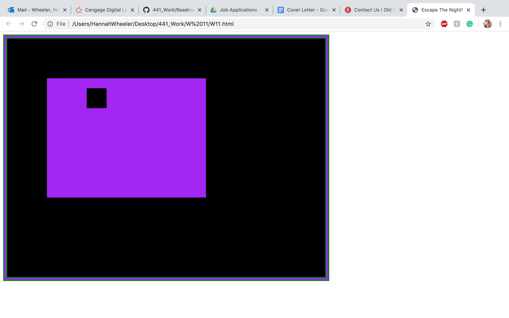

## Week 11
Hannah Wheeler

# Work Cycle
---
This week was not very difficult due to I was able to receive got A LOT of extra 
help from my classmates and one of my more advanced at coding friend. I'm pretty
happy with how it turned out!

# Successes
---
I was able to implement a color array that I learned in
creative coding last semester, so that was fun!

# Difficulties
---
There is some glitching  of the square
sometimes, I decided to use these glitches as part of the game. I decided to
implement a NO ESCAPE them. I beleive this is a fun aspect in that the player
will attempt to escape several times before realizing there is no escape.

