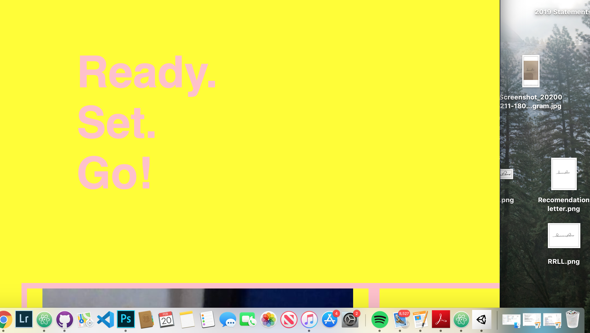

#441_Work

Homework repository for MART 441

Base URL for site:
https://github.com/hannahlouwho/441_Work
<!DOCTYPE html>
<html>
    <head>
        <title>Hannah's 441 Site</title>
    </head>
    <body>
        <h1>Hannah's 441 Homework Site</h1>

        # Homework 5

This week was okay. I am having trouble with the padding and margins of the
table. I think its fixed and I cant figure out how to undo that. Hopefully I
can soon. Just as well I think it looks alright besides that technical
difficuty! I did reference Cassens' example code. Hopefully, not too much!
I do like some of my stylings. They turned out better than I had origionally
planned. I kinda just picked a couple colors and went with it. I was also
origionally going to do this with babies....but since I am a cat mom I
decided the kitties were funnier.

    </body>
</html>
