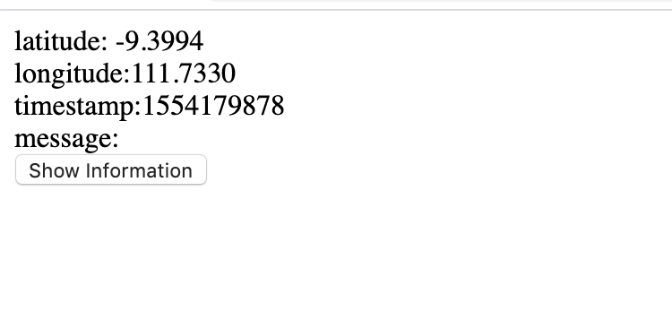

## Week 9
Hannah Wheeler

# Work Cycle
---
This was actually really difficult for me. I started over several times and
completely scrapped what I was working on several times and referenced a lot of
other students work. I still cant get the info to appear with AJAX, or JSON. But
Im working on it!

# Successes
---
I was at least able to produce info when it is called on by the methods.
But only with Html so far

# Difficulties
---
I cant get the information to produce in AJAX, and JSON

